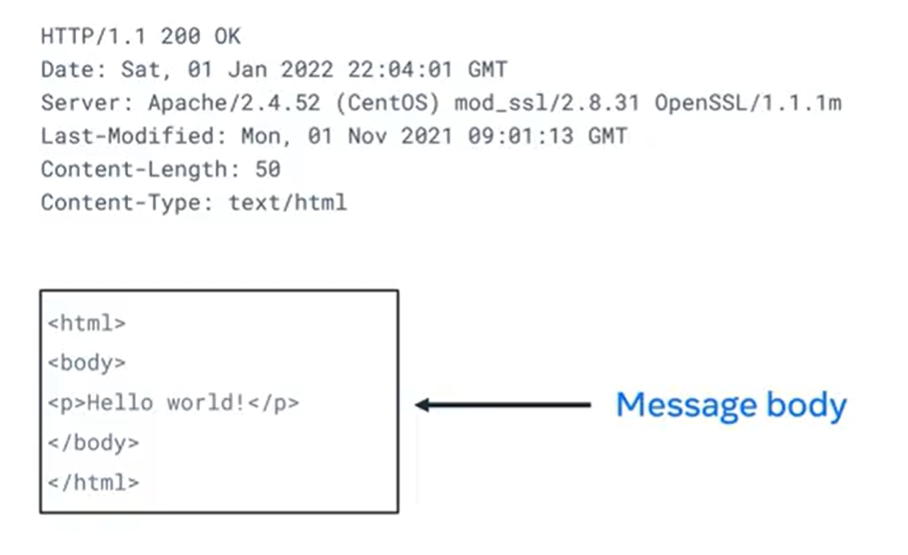

# Introduction to Frontend Development
* Javascript is the **powerhouse** of Frontend and has the ability to manipulate the content of the page.
* Because of its,
    1. Versatilities
    2. Libraries
    3. Frameworks
    4. React
#### What forntend developer do?
   &emsp; They are tend to solve problems and create a interface that user can interact and we will be work collaborative with developers and Project manageres and not only just typing in the laptop we also having work for collaborative things.
#### How to be successful?
1. Create a dedicated study space 
2. Set daily goals for studying 
3. Schedule time to study on your calendar 
4. Keep yourself accountable 
5. Actively take notes 
6. Join the discussion 
7. Do one thing at a time 
8. Take breaks 
#### How web works?
&emsp; If one computer is connected to another computer, then there is no issue, what if at a time lot of computer is making request. So to eliminate the problem there is a inter connected networks that helps to connect through the computer via wired or wireless connections and helps to route to respective system. That network also connected to lot networks. This is called **INTERNET**.
#### Web Server
* Website Storage and Administration
* Data Storage
* Security
* Managing Email
* It can store everything in their datacenter by a physical manner and the program that runs on the hardware is the software.
* Webserver also do request response cycle that is, it accepts the request from the client and give response back to the client.
* It will also manage multiple requests from the clients.
#### Websites and WebPages
* Webpages are page that shows texts,images,vidoes and some contents to the user whereas websites contains collection of webpages that are linked together.
* **Building** is like HTML and the interior and exterior **decorations** are like CSS and the people and **business** going on the building is like JavaScript.
* Which are the languages that made up of **angle brackets** (<>) that come under Markup language.
#### How Web Browser works
* Web browser always have a status bar, in that we have to enter the address which contains protocol name, domain name and file path.
* Then this address is carried by the specified protocol to the respective server and give back the response.


#### Web Hosting
1. Shared hosting
2. Virtual Private Hosting
3. Dedicated Hosting
4. Cloud Hosting
* Web hosting is a service which was managed by some companies server, where we can take rent some spaces and store our websites and files.
#### Internet protocol (IP address)
* It is the unique address that every computer has and data are transmitted through this and it is same to the postal address.
* Ipv4 version 4 is -> **192.0.2.168**
* Ipv6 eight groups of hexadecimal digits separated by **colons**
* Data are transmitted through internet by **Ip Packets or Data grams**.
* Ip packets have Ip header and payload. Header have source and destination address and payload have data to be transmit.
* Here there is a case of,
    1. IP packets arrive out of order
    2. Became damaged or corrupted
    3. Dropped or lost
* To resolve this, the payload of packets have two additional protocols are TCP (Transmission control protocol) and UDP (User Datagram Protocol).
* TCP is for to send the **data stream in order**, it usually sends text and images whereas UDP helps **do not lost data** and it for voice and live video streams.
#### Hyper Text Transfer Protocol (HTTP)
* It have method, path and header
```
    #Request line -> consists of METHOD, resource requested and version
    GET/HTTP/1.1
    #header
    Host: developer.mozilla.org
    Accept-language:en
```

* Request headers are,
1. **Host** -> specify Host of the server that is client name
2. **User-Agnet** -> Mostly it the OS and browser
3. **Accept** -> what type of content that client should be accept
4. **Accept-Language** -> what type of language that client should be accept
5. **Content-type** -> which data format could be transmitted
* After the Request header there is a request body and it mainly for **POST** and **PUT**

* Http response

1. First line is the **Status line** which consists of Version and status code with phrase.
2. Response Headers are,
    * **Date** -> specify date and time
    * **Server** -> which web server software was generated the response
    * **Content-Length** -> length of the response
    * **Content-Type** -> media type of the resource returned (html,video)
#### Status codes
* Informational -> 100-199 => indicate to continue or ingnore the response if it is already processed.
* Successfull -> 200-299 
* Redirection -> 300-399 => indicate the request is moved somewhere else
* Client error -> 400-499 
* Server error -> 500-599
-----------------------------------------------
* Websites are informative whereas webapplications are interactive, for example company - website and ordering - applications.
#### Libraries and Frameworks
* **Open-Source** -> it is a public code which everyone can modify by their wish and use wherever they want.
* Libraries are **pre-built code** do to specific funtionality and we can **re-use** it in out code and it is like carpenter using **hammer** as library for manufacture the chair.
* So with the help of Libraries, developers can **save the time** and utilize that time for developing purpose.
* Framework is create **structure** for development and it can handle http request and give back response. Eg.,ASP.NET.

* RESTful -> Representational State Transfer api.

### Additional Resources
HTTP Overview (Mozilla)

https://developer.mozilla.org/en-US/docs/Web/HTTP/Overview

Introduction to Networking by Dr.Charles R Severance

https://www.amazon.com/Introduction-Networking-How-Internet-Works/dp/1511654945/

Chrome Developer Tools Overview (Google)

https://developer.chrome.com/docs/devtools/overview/

Firefox Developer Tools User Docs  (Mozilla)

https://firefox-source-docs.mozilla.org/devtools-user/index.html

Getting Started with Visual Studio Code  (Microsoft)

https://code.visualstudio.com/docs

